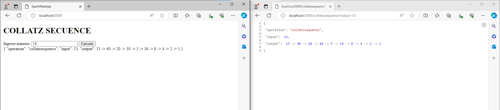

# PARCIAL 2

## Getting Started

Diseñé, construya y despliegue un aplicación web para investigar la conjetura de Collatz. El programa debe estar desplegado en un microcontenedor Docker corriendo en AWS. LAs tecnologías usadas en la solución deben ser maven, git, github, maven, sparkjava, html5, y js. No use liberías adicionales.

### Prerequisites

Cosas que necesitas instalar y cómo hacerlo.

- [Java Development Kit (JDK)](https://www.oracle.com/java/technologies/javase-jdk11-downloads.html)
- [Maven](https://maven.apache.org/install.html)
- [DockerDesktop](https://www.docker.com/products/docker-desktop/)

### Installing

Sigue estos pasos para configurar tu entorno de desarrollo:

1. Clona el repositorio:

   ```bash
   https://github.com/juan-bazurto-eci/Collatz
2. Navega al directorio del proyecto

    ```
   cd Collatz
   ```

3. Hacemos la construccion del proyecto

   ```
   mvn package
   ```

## Deployment

Ejecutamos los siguientes comandos

    mvn clean package install
    mvn clean install

Corremos el servidor (localhost)

#### AppWeb

    docker build --tag appweb -f .\src\main\java\co\edu\escuelaing\arep\appweb\Dockerfile .
    docker run -d -p 8080:8080 appweb

#### Collatz

    docker build --tag collatz -f .\src\main\java\co\edu\escuelaing\arep\collatz\Dockerfile .
    docker run -d -p 5000:5000 -e PORT=5000 collatz

### Se debe tener en cuenta que el proyecto está configurado para correr en EC2


## Running the tests

El servidor responde a todas las funciones



## AWS

Configuramos EC2 para el proyecto y configuramos las reglas

Lanzamos docker y en los respectivos puertos corremos las imagenes de DockerHub

## Built With
* [Java](https://www.java.com/) - Lenguaje de programación principal
* [Maven](https://maven.apache.org/) - Gestión de dependencias y construcción del proyecto
* Git - Control de versiones
* HTML, JavaScript - Interfaz de usuario
* [DockerHub](https://hub.docker.com/)
* [SparkJava](https://sparkjava.com/)
* [Amazon Web Services](https://aws.amazon.com/)

## Authors

* **Juan Camilo Bazurto** - [Linkedin](https://www.linkedin.com/in/juan-camilo-b-b65379105/) - [GitHub](https://github.com/juan-bazurto-eci)